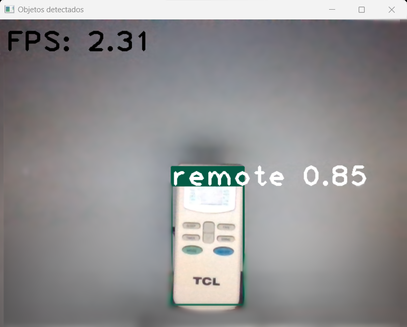

# Object Detector with YOLOv3

This project implements a real-time object detector using the YOLOv3 architecture and OpenCV. The detector can identify and draw bounding boxes around multiple objects in a live video stream.

## Requirements

- Python 3.x
- OpenCV
- NumPy

## Installation

1. Clone or download this repository:

~~~
https://github.com/AlejoLg1/Object-Detector.git
~~~

2. Install the necessary dependencies:

~~~
pip install opencv-python numpy
~~~

## Usage

1. Run the `main.py` script:

~~~
python main.py
~~~

2. The application will start capturing video from the live camera and detecting objects in each frame.

3. To stop the application, press the 'q' key.

## Customization

- You can adjust hyperparameters such as the confidence threshold (`confidence_threshold`) and non-maximum suppression threshold (`nms_threshold`) in the `main.py` file as needed for your application.
- To use your own YOLOv3 model, make sure to update the configuration and weight files in the `cv2.dnn.readNetFromDarknet()` function.

## Factors Affecting Performance

The application's performance may vary significantly depending on the user's computer system components. Below are some key factors that may influence the user experience:

- Processor (CPU)
- Graphics card (GPU)
- RAM memory
- Hard drive

## Images

